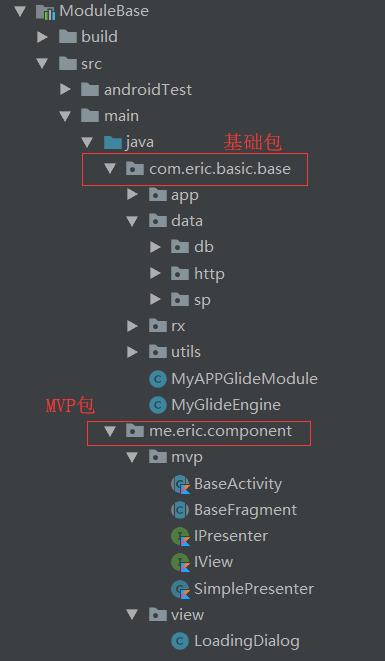
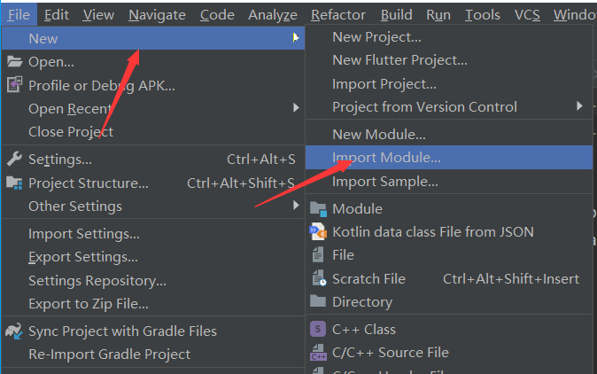
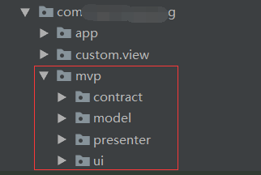
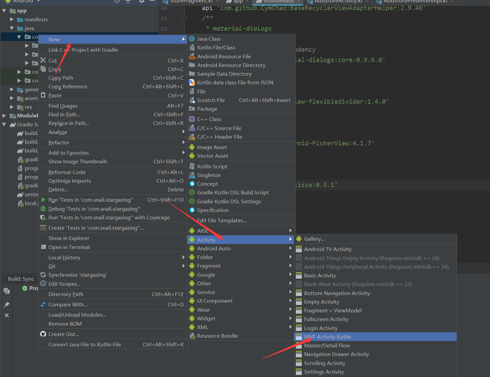
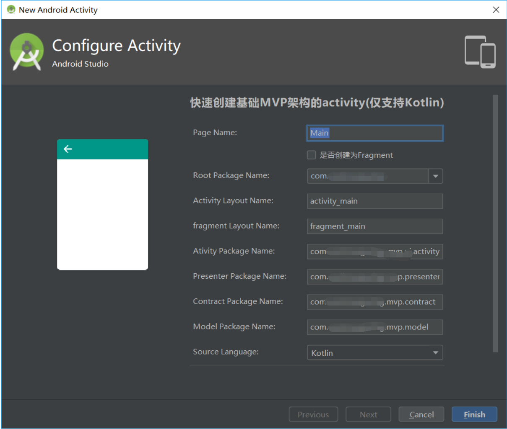

### AndroidQuickMVP  
致力于快速实现Android MVP架构的快速开发，其中含有两大模块，分别是ModulesBase和MVPKtActivity下面将介绍两个模块的作用和如何使用。  
### ModulesBase  
  

在该模块中集成了RxJava、Glide等常用的基础三方库  
```
dependencies {
    api "org.jetbrains.kotlin:kotlin-stdlib-jdk7:$kotlin_version"
    api "com.android.support:appcompat-v7:$support_version"
    api "com.android.support:support-v4:$support_version"
    api "com.android.support:cardview-v7:$support_version"
    api "com.android.support:recyclerview-v7:$support_version"
    api "com.android.support:design:$support_version"
    api 'com.android.support.constraint:constraint-layout:1.1.3'
    /**
     * mvp基础
     */
    /**
     * 网络相关和其他异步逻辑业务
     * retrofit、rxJava、rxAndroid、内含oKHttp3
     */
    api 'com.squareup.retrofit2:retrofit:2.5.0'
    api 'com.squareup.retrofit2:adapter-rxjava2:2.4.0'
    api 'com.squareup.retrofit2:converter-gson:2.4.0'
    api 'io.reactivex.rxjava2:rxjava:2.1.16'
    api 'io.reactivex.rxjava2:rxandroid:2.0.2'
    api 'com.trello.rxlifecycle2:rxlifecycle-components:2.2.1'
    api 'com.squareup.okhttp3:logging-interceptor:3.9.1'
    api 'com.github.tbruyelle:rxpermissions:0.10.2'
//    /**
//     * kotlin 协程
//     */
//    api 'org.jetbrains.kotlinx:kotlinx-coroutines-core:0.27.0-eap13'
//    api 'org.jetbrains.kotlinx:kotlinx-coroutines-android:0.27.0-eap13'
    /**
     * json相关
     * Gson from Google
     */
    api 'com.google.code.gson:gson:2.8.5'
    /**
     * 图片相关
     * Glide：加载图片（本地或网络）
     * circleImageView：圆形图片
     * crop：图片选择+图片裁剪
     */
    api 'com.github.bumptech.glide:glide:4.7.1'
    annotationProcessor 'com.github.bumptech.glide:compiler:4.7.1'
    api 'de.hdodenhof:circleimageview:2.2.0'
    api 'com.soundcloud.android:android-crop:1.0.1@aar'
    /**
     * 上、下拉刷新
     */
    api 'com.scwang.smartrefresh:SmartRefreshLayout:1.1.0-alpha-5'
    api 'com.scwang.smartrefresh:SmartRefreshHeader:1.1.0-alpha-20' //没有使用特殊Header，可以不加这行
    /**
     * recycler adapter
     */
    api 'com.github.CymChad:BaseRecyclerViewAdapterHelper:2.9.46'
    /**
     * material-dialogs
     */
    //noinspection GradleDependency
    api 'com.afollestad.material-dialogs:core:0.9.6.0'
    /**
     * recyclerView的分割线
     */
    api 'com.yqritc:recyclerview-flexibledivider:1.4.0'
    /**
     * picker view
     */
    api 'com.contrarywind:Android-PickerView:4.1.7'
    /**
     * image picker
     */
    api 'com.zhihu.android:matisse:0.5.1'
}
```
只需要将该模块以model的方式引入到工程即可  
在导入之前需要在build.gradle中添加如下代码
```
buildscript {
    ext{
        is_component = true
        compile_version = 28
        min_version = 21
        target_version = 28
        support_version = '28.0.0'
        gradle_version = '3.3.1'
        app_id = "com.snail.stargazing"
        code_version = 1
        version_name = "1.0"
        kotlin_version = '1.3.20'
    }
}
```
  
### MVPKtActivity  
  

该模块是一个模板，能够快速生成MVP对应的代码。可以用于生成Activity、Fragment。  
1. 导入模板
```
下载该工程，并将MVPKtActivity放到Android studio的模板目录下
模板目录：Android Studio安装目录\plugins\android\lib\templates\activities
```
2. 自动生成代码  
  

